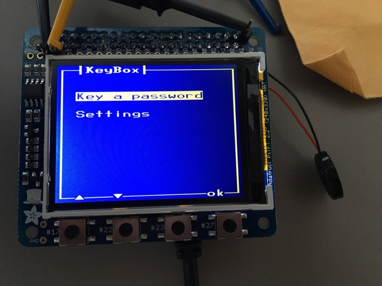
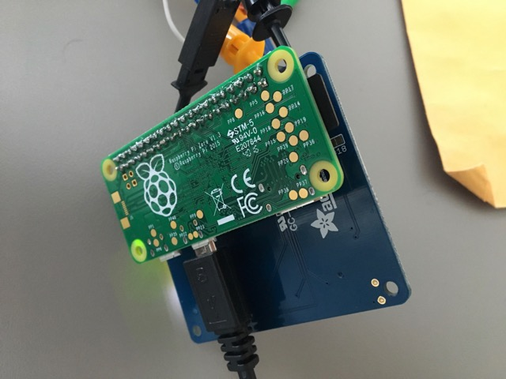

KeyBox Project
--------------

The KeyBox project combines a Raspberry Pi Zero, a small TFT display, and some software
into a device that holds cryptographic keys and passwords.

 

**IMPORTANT** This software is considered to be in Alpha state until there is confidence around the project.
If you have any questions about this project, open a github issue.

## Features

The device will emulate and ssh-agent and allow you to keep all of your ssh keys
securely on this device. When the remote machine asks to authenticate, the user is presented with a 
UI to accept or deny the request.

The device will hold your passwords and allow you to play them back by emulating a USB keyboard.
This is useful for machines that require a password upon boot to un-encrypt a hard drive.

## Software and Build Instructions

This is the central repository for the KeyBox project.
It will have pointers to other repos necessary to build the KeyBox distribution.

* [kb-gui](https://github.com/drudru/kb-key) - presents UI on tft
* [kb-key](https://github.com/drudru/kb-key) - sends emulated keystrokes

[Installation Instructions](Install/INSTALL.md)

[Build Instructions](Build/BUILD.md)

## Motivation

The system is supposed to be an improvement over a typical existing installation. In a typical scenario, 
experienced computer users (software engineers, etc.) will store their ssh keys unencrypted in a known
location in their home directory. They will typically be using a desktop OS that has unknown security gurantees
(Windows, Mac OS X, Linux, etc). One compromise gives the attacker access to those ssh keys. Even if
some of the above were addressed, most modern desktop/laptop systems have CPUs with poorly documented 
"management engines". These could provide an attacker unlimited access to anything on the system.

Users also typically choose bad passwords. They typically do this because they are easier to memorize and therefore type.

The solution is a 'more trusted' device that has the sold duty of managing keys and passwords. It will be much easier
to secure a small system dedicated to these functions vs. a desktop operating system.

The device must:

* Be able to emulate USB devices reliably
* Present an audio and visual alert when a request is made of the device
* Keep all of its state on a microSD card
* Be inexpensive and widely available
* Be reliable

A Raspberry Pi 0 has an ideal mix of features:

* Relatively open design.
* Very wide distribution.
* The Raspberry Pi 0 can emulate USB devices in OTG mode.
* Lots of suppliers for add-on components.
* No radio. The only way in our out is a wire.
* Inexpensive (total cost can be below $50 retail)
* Probably more trustworthy than an Intel, AMD, etc. processor.
* Excellent Linux support by the Raspberry Pi team on github.
* More CPU than a typical embedded system with security module (1 GHz)
* All storage is on microSD. No internal flash to worry about.
* The device supports inexpensive, SPI TFT displays

## Hardware

The key to KeyBox is the fact that the Raspberry Pi 0 connects its USB hardware directly to 
the USB ports. This allows it to emulate USB devices via USB On-The-Go.
The Raspberry Pi 2/3 connects its System-On-Chip to a USB hub which prevents this functionality.

* Raspberry Pi 0
  * Probably supports Pi 0 W or Pi A+ - not tested
  * At this time, Raspberry Pi 0 (not W) is recommended from a security standpoint.
* Adafruit 2.2" TFT HAT
  * Has 4 buttons. Requires little soldering.
* Piezo Buzzer
* 3D Case
  * I don't have a 3D printer or case design currently.
  
There will be a separate section that can go into more details about the hardware and 
support for other platforms (BeagleBone, Arduino, etc.)

## License

I will add the license files, but everything in this repo is under a MIT license.

## Known Issues

* The keys and passwords are not stored in an encrypted store on the microSD.
  * This is an interesting and hard problem due to the limited UI control, 4 buttons
  * The choice of buttons was by design. The risk of a touchscreen misinterpreting
    an accept or deny request on low-cost displays is unknown, so it is avoided.
  * A github issue will be created to track this
 * This is a new project, so it has not been reviewed.
 * Key and Password management are an issue
 * The existing build is not an optimized linux distribution
   * It takes a long time to boot
 * Key management requires logging into the device to manipulate files

## Roadmap

* Needs a case
* Improved method of key management
  * Possibly a text UI at this point
* Key generation for ssh
  * Generate keys
  * Emulate vi/emacs/text to play the public key for addition to authorized_keys
* A minimal zip file distro that just utilizes a FAT filesystem.
* Re-design the kb-gui system
* Investigate a clang build system. It would be good to compare with existing gcc system.
* 2017-08-17 - Just read that new RASPBIAN STRETCH LITE has been released.
For now, I am working with an updated Jessie image. Need to investigate this new release.
* Possibly integrating the camera module
* Other key storage features (keys or crypto for other systems)

